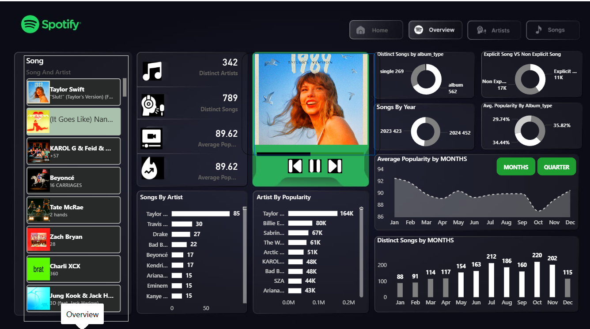
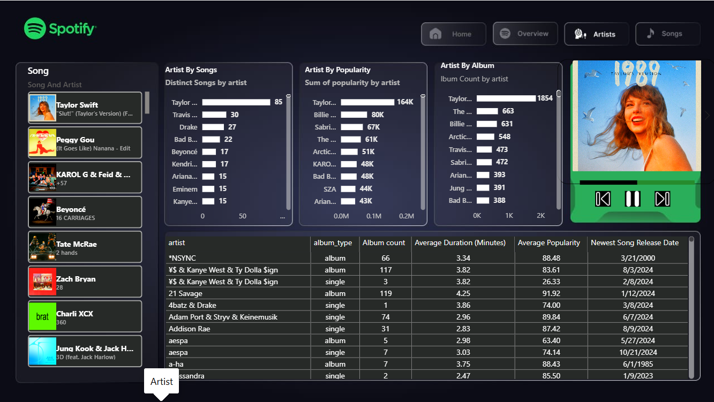
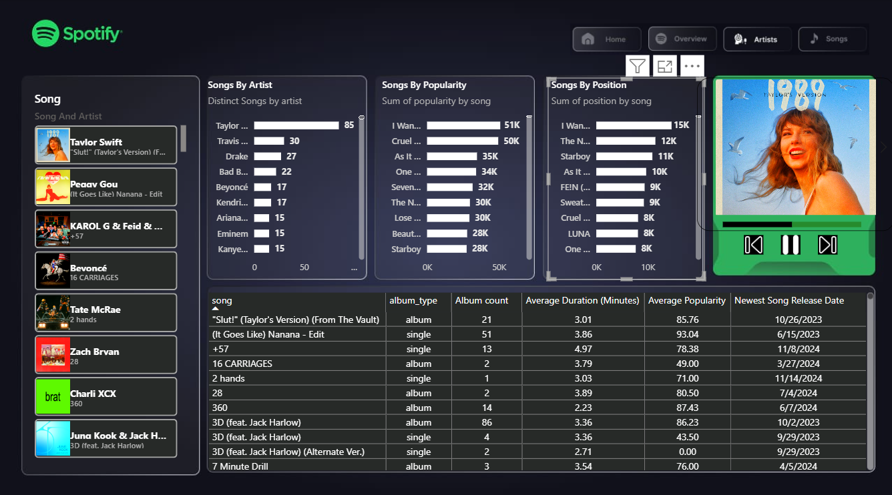

# 🎵 Spotify Music Analytics Dashboard

> A comprehensive Power BI dashboard analyzing Spotify music data — covering artists, songs, popularity trends, and album statistics.

---

## 📌 Table of Contents

- [Overview](#overview)
- [Pages](#pages)
  - [🏠 Home](#-home)
  - [📊 Overview](#-overview)
  - [🎤 Artists](#-artists)
  - [🎵 Songs](#-songs)
- [Key Metrics](#key-metrics)
- [Tech Stack](#tech-stack)

---

## Overview

This Power BI report provides deep insights into Spotify's music catalog. It covers 342 distinct artists, 789 distinct songs, and tracks popularity, duration, album type, and release trends across months and quarters.

---

## Pages

---

### 🏠 Home

The **Home** page serves as the landing screen of the dashboard. It features the Spotify branding with a dark background and a collage of album covers on the right side. Navigation buttons — **Home**, **Overview**, **Artists**, and **Songs** — are prominently displayed for easy access to all sections.

---

### 📊 Overview

The **Overview** page gives a bird's-eye view of all key metrics in one place.

**Highlights:**
- **342** Distinct Artists
- **789** Distinct Songs
- **89.62** Average Popularity Score
- Donut charts showing:
  - Songs by Album Type (Singles: 269, Albums: 562)
  - Songs by Year (2023: 423, 2024: 452)
  - Explicit vs Non-Explicit Songs (Explicit: 11K, Non-Explicit: 17K)
  - Avg. Popularity by Album Type
- **Songs By Artist** bar chart (Taylor Swift leads with 85 songs)
- **Artist By Popularity** bar chart (Taylor Swift: 164K total popularity)
- **Average Popularity by Months** line chart
- **Distinct Songs by Months** bar chart
- Left sidebar with a scrollable **Song & Artist** list with album art
- Featured album player widget (Taylor Swift – 1989)

---

### 🎤 Artists

The **Artists** page focuses on artist-level analytics.

**Charts included:**
- **Artist By Songs** — Distinct songs count per artist (Taylor Swift: 85, Travis Scott: 30, Drake: 27...)
- **Artist By Popularity** — Sum of popularity per artist (Taylor Swift: 164K, Billie Eilish: 80K, Sabrina Carpenter: 67K...)
- **Artist By Album** — Album count per artist (Taylor Swift: 1854, The Weeknd: 663, Billie Eilish: 631...)

**Data Table** includes:
| Column | Description |
|--------|-------------|
| Artist | Artist name |
| Album Type | Album or Single |
| Album Count | Number of albums/singles |
| Avg. Duration (Minutes) | Average song length |
| Average Popularity | Mean popularity score |
| Newest Song Release Date | Most recent release |

---

### 🎵 Songs

The **Songs** page provides song-level deep dives.

**Charts included:**
- **Songs By Artist** — Number of songs per artist
- **Songs By Popularity** — Top songs by total popularity (I Wan... 51K, Cruel... 50K, As It Was: 35K...)
- **Songs By Position** — Sum of chart position per song

**Data Table** includes:
| Column | Description |
|--------|-------------|
| Song | Song title |
| Album Type | Album or Single |
| Album Count | Appearances across albums |
| Avg. Duration (Minutes) | Song length |
| Average Popularity | Popularity score |
| Newest Song Release Date | Latest release date |

---

## Key Metrics

| Metric | Value |
|--------|-------|
| Total Distinct Artists | 342 |
| Total Distinct Songs | 789 |
| Average Popularity | 89.62 |
| Top Artist (by Songs) | Taylor Swift (85 songs) |
| Top Artist (by Popularity) | Taylor Swift (164K) |
| Most Albums | Taylor Swift (1854) |
| Songs Released in 2024 | 452 |
| Songs Released in 2023 | 423 |

---

## Tech Stack

- **Visualization Tool:** Microsoft Power BI
- **Data Source:** Spotify Dataset
- **Design Theme:** Dark mode with Spotify green accents (`#1DB954`)

---

## 📁 Dashboard Screenshots

| Page | Preview |
|------|---------|
| Home |  |
| Overview |  |
| Artists |  |
| Songs |  |

---

> **Note:** To view the live dashboard, open the `.pbix` file in Power BI Desktop.
